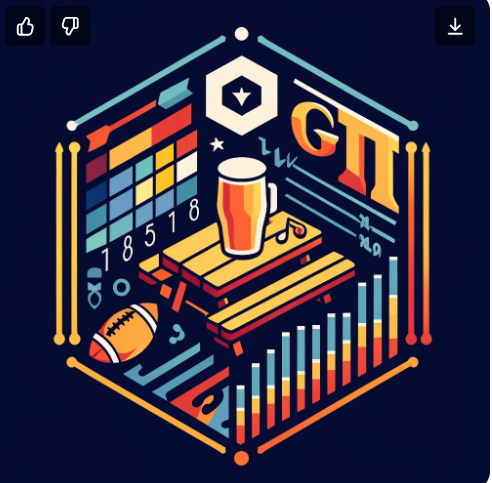

## glitr 
SI styled gt themes to adorn your tables

  <!-- badges: start -->
  [](https://github.com/USAID-OHA-SI/gtayblr/actions/workflows/R-CMD-check.yaml)
  [](https://usaid-oha-si.r-universe.dev/gtayblr)
  [](https://lifecycle.r-lib.org/articles/stages.html#stable)
  [](https://usaid-oha-si.r-universe.dev/)
  <!-- badges: end -->

### OHA SI GT Themes
Inspired by `glitr` the gtayblr package makes it easy to make pre-formatted gt tables following SI guidance. 

### Installing gtayblr
`gtayblr` is not on CRAN, so you will need to install it directly from github. 

``` r 

  # install from GitHub using pak
    install.packages("pak")
    pak::pak("USAID-OHA-SI/glitr")

```
